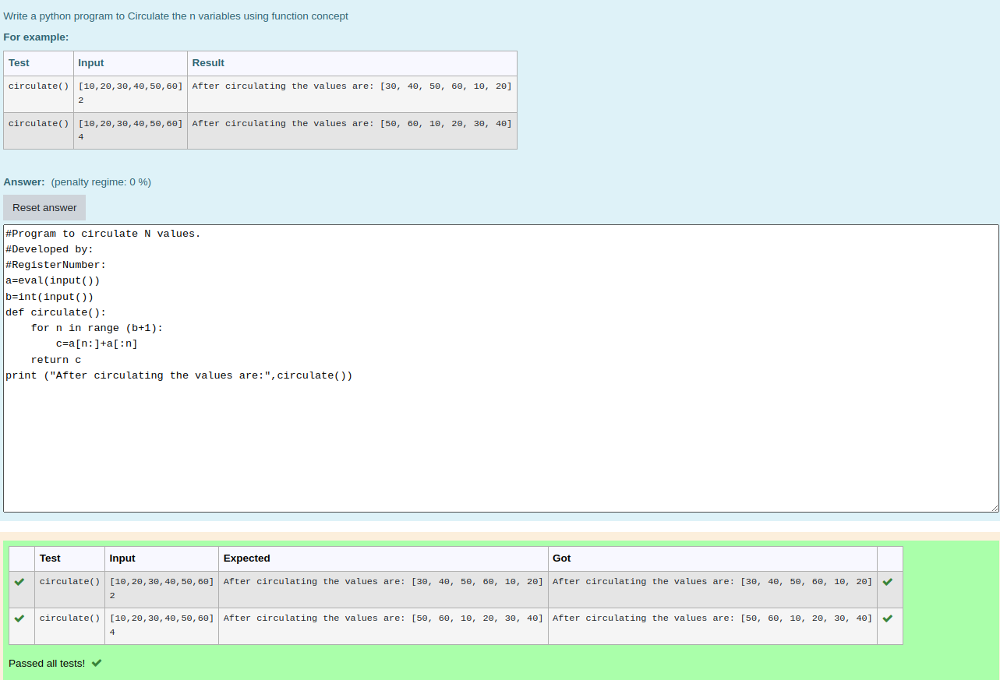

# Circulate-the-values-of-N-variables

## Aim:

To write a python program to circulate the n variables using function concept

## Equipment’s required:

PC
Anaconda - Python 3.7

## Algorithm: 

### Step 1: 

Get the n values from the user

### Step 2: 

Get the input

### Step 3:

Get the value from the user for the number of rotation

### Step 4: 

Using the slicing concept rotate the list

### Step 5: 

print the values it would be interchanged

### Step 6: 

End the program

## Program:
```python
#Program to circulate N values.
#Developed by:KANIMOZHI P
#RegisterNumber:22002752
def circulate():
    circul = l[n:]+l[:n]
    print('After circulating the values are:',circul)
l = eval(input())
n = int(input())
```

## Output:


## Result:

Thus the circulation of the n variables are successfully excueted